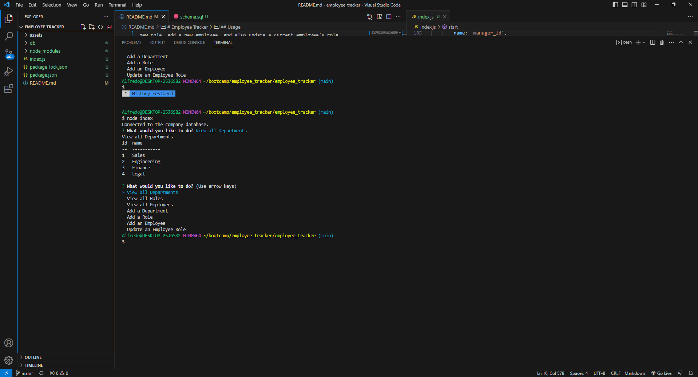

# Employee Tracker

## Description

The purpose of this app is to work as a content management systems(CMS). Its a command-line application that was made from scratch to manage a company's employee database. The application will show the user all the departments, roles, and employees. It will also allow the user to add a new department, add a new role, add a new employee, and also update a current employee's role. 

## Installation

To run this application you will need to install mysql2, express, inquirer, and also console.table. Console.table allows the sql tables to be print out as tables in the terminal.
URL: https://github.com/AlfredoJi/employee_tracker

## Usage

The user types "node index.js" to run the application in the terminal. A menu will print out with the choices view all departments, view all roles, view all employees, add a department, add a role, add an employee or update an employee role. If the user picks view all departments, view all roles or view all employees it will print them out as a table and take the user back to the menu. If the user picks add a department, add a role, add an employee or update an employee role then the user will be asked a couple questions and will print out the results into the new table.
Walkthrough Video: https://drive.google.com/file/d/186dfcwCSg8pk3ufDn59pOq4Q5PDggvdZ/view

## Image

